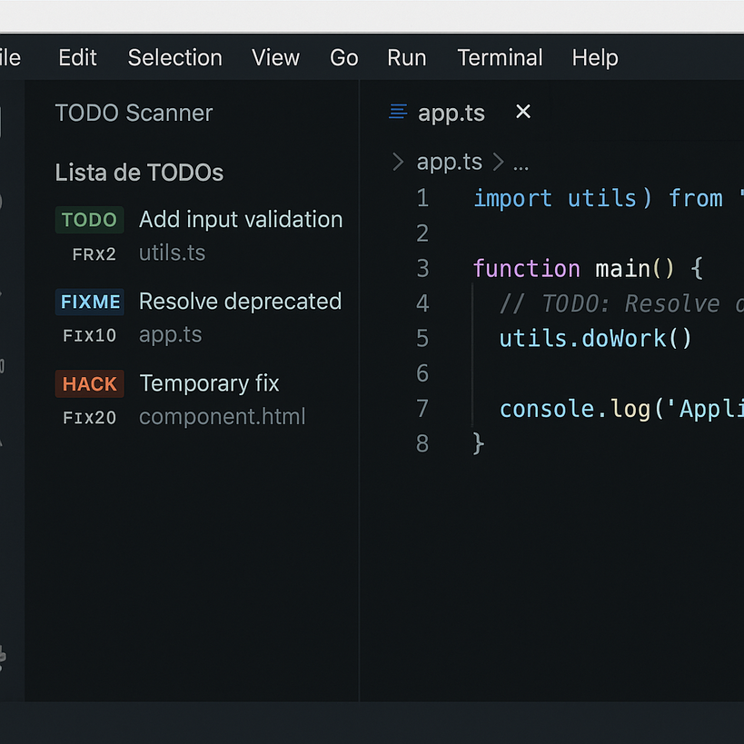

# TODO Scanner

Extensión para VS Code que escanea automáticamente todos los archivos de tu proyecto en busca de comentarios tipo `TODO:`, `FIXME:`, `HACK:`, y los muestra en una vista lateral interactiva.

## Características

- Escanea archivos `.ts`, `.js`, `.html`, `.scss`.
- Vista lateral fija en la barra izquierda.
- Actualización automática al guardar archivos.
- Navegación directa al archivo y línea desde la lista.

## Comandos

- `Mostrar TODOs`: escanea manualmente el proyecto (útil si cierras la vista).

## Instalación manual

1. Ejecuta `vsce package`.
2. Instala el `.vsix` con `code --install-extension nombre.vsix`.

## Licencia

MIT
